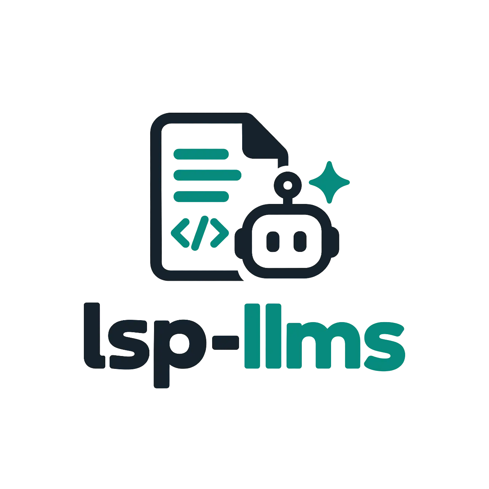
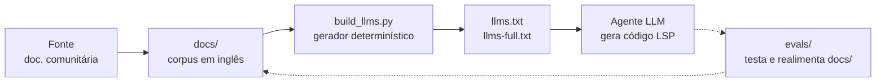

<picture>
  <source media="(prefers-color-scheme: dark)" srcset="assets/logo-w.webp"/>
  
</picture>

# lsp-llms

Documentação da LSP (Linguagem Senior de Programação) estruturada para uso por LLMs e agentes de codificação.

[Documentação](docs/index.md) · [Corpus completo](llms-full.txt) · [Avaliações](evals/README.md)

---

O **lsp-llms** transforma documentação comunitária de LSP em uma referência estruturada, rastreável e avaliada para geração de código com IA.

## O que é LSP

LSP (Linguagem Senior de Programação) é a linguagem de regras de negócio do ERP da Senior Sistemas: é nela que se escrevem validações, relatórios, cálculos e integrações dentro do ecossistema Senior. A documentação de referência da comunidade está em português e é extensa, mas não foi escrita para consumo por IAs — o que faz assistentes de codificação inventarem sintaxe, funções e comportamentos que não existem.

## O problema que este projeto resolve

Modelos de linguagem geram código LSP plausível, porém errado: usam construções de outras linguagens, presumem tipos de campos pelo nome e preenchem lacunas com suposições. O `lsp-llms` reorganiza a documentação comunitária existente em um corpus estruturado em inglês, com rastreabilidade até a fonte, incertezas explicitamente marcadas — e mede, com avaliações executadas em ambiente Senior real, se a documentação de fato ajuda a gerar LSP válido.

## Como funciona



1. **Fonte** — a documentação comunitária de LSP (em português) é a fonte primária da transformação, nunca a criatividade de quem documenta.
2. **`docs/`** — corpus estruturado em inglês, um tópico por arquivo, com exemplos preservados e cada afirmação classificada por nível de evidência (vocabulário completo em `docs/index.md`).
3. **`scripts/build_llms.py`** — gerador determinístico (Python 3, só biblioteca padrão): lê `docs/` e produz `llms.txt` e `llms-full.txt` byte-idênticos a cada execução.
4. **Artefatos** — `llms.txt` é o índice compacto de entrada; `llms-full.txt` é o corpus completo consolidado. Nenhum dos dois é editado à mão.
5. **Uso e avaliação** — o agente consome os artefatos para gerar LSP, e as suítes em `evals/` testam o resultado (inclusive compilando e executando em Senior de verdade); falhas diagnosticadas realimentam `docs/`.

## Estrutura do repositório

| Caminho | Papel |
|---|---|
| `docs/` | Fonte estruturada do projeto. Um tópico por arquivo; `docs/index.md` é o mapa de navegação e cobertura. |
| `docs/index.md` | Mapa canônico: o que está documentado, o que ainda não foi transformado e o vocabulário de evidências. |
| `llms.txt` | Artefato gerado: ponto de entrada compacto (orientação + links para as páginas). Não editar. |
| `llms-full.txt` | Artefato gerado: corpus completo consolidado em ordem determinística. Não editar. |
| `scripts/build_llms.py` | Gerador determinístico dos artefatos (Python 3, só stdlib). |
| `evals/` | Suítes de avaliação: metodologia, casos congelados e resultados por modelo. Nunca entram no corpus. |
| `assets/` | Identidade visual (logos para tema claro/escuro em WebP e banner em SVG). O diagrama de fluxo é Mermaid inline na seção "Como funciona". |
| `LICENSE` | Licença MIT. |

## Como usar com LLMs e agentes

Há dois modos, conforme a necessidade:

- **Trabalho focado** — comece por `docs/index.md` e recupere só o tópico relevante (sintaxe, cursores, datas etc.). Ideal para RAG e agentes com recuperação seletiva.
- **Contexto total** — forneça `llms-full.txt` inteiro ao modelo junto da tarefa. Ideal para geração assistida pontual.

Exemplo de prompt:

```text
Você está gerando código na linguagem LSP (Linguagem Senior de Programação).
Use APENAS a sintaxe documentada na referência abaixo. Não invente funções,
parâmetros ou comportamentos, não infira regras de outras linguagens e, se
algo não estiver documentado, diga isso em vez de supor.

<colar aqui o conteúdo de llms-full.txt ou da seção relevante de docs/>

Tarefa: <descreva o que a regra deve fazer>
```

A documentação preserva de propósito as incertezas e contradições encontradas nas fontes — o modelo deve seguir o padrão documentado mais seguro e indicar quando a evidência for insuficiente.

## Geração dos artefatos

Pré-requisito: Python 3 (sem dependências externas).

```bash
python scripts/build_llms.py          # gera llms.txt e llms-full.txt
python scripts/build_llms.py --check  # verifica se estão atualizados, sem escrever
```

Garantias do processo:

- **Determinístico**: a mesma árvore `docs/` sempre produz bytes idênticos (UTF-8, LF, sem timestamps nem aleatoriedade).
- **Sem edição manual**: correções entram em `docs/` e os artefatos são regenerados.
- **Separação estrita**: o gerador consome apenas `docs/**/*.md`; nada de `evals/` vaza para `llms.txt` ou `llms-full.txt`.
- **Cobertura incremental**: um tópico ausente significa "ainda não transformado", nunca "não existe em LSP".

## Cobertura atual

| Domínio | Arquivo | Conteúdo |
|---|---|---|
| Sintaxe e estrutura | `docs/language/syntax.md` | Terminação, blocos, comentários, continuação de linha, formatação. |
| Variáveis e tipos | `docs/language/variables.md` | `Definir`, tipos `Alfa`/`Numero`/`Data`, convenções de nome, onde declarar. |
| Controle de fluxo | `docs/language/control-flow.md` | `Se`/`Senao`, `Para`, `Enquanto`, `Pare`, `Continue`, `VaPara`. |
| Arrays e índices | `docs/language/arrays.md` | Declarações com colchetes, iteração, evidência 1-based vs 0-based. |
| Lista, Tabela e Grid | `docs/language/collections.md` | API de `Lista`, núcleo `ListaRegra*`, `Tabela`, limites de Grid. |
| Limitações e armadilhas | `docs/guides/limitations.md` | Parâmetros de saída, regras de `Mensagem`, conversões, `Cancel`. |
| Strings | `docs/functions/strings.md` | Concatenação, extração, busca, substituição, ASCII, listas delimitadas. |
| Datas e horas | `docs/functions/dates-time.md` | Data atual, construção, decomposição, formatação, aritmética. |
| Conversões de tipo | `docs/functions/conversion.md` | Matriz de conversões com evidência, máscaras, catálogo de falhas. |
| Matemática | `docs/functions/numeric-math.md` | Truncamento, arredondamento, formatação, divisão, extenso. |
| Cursores e SQL | `docs/database/cursors-sql.md` | Cursores simples vs. completos, parâmetros, `SelecaoTabelas`, transações. |
| Arquivos | `docs/io/files.md` | E/S de texto por handle, existência, contagem de linhas, temporários. |
| JSON | `docs/data/json.md` | Leitura de campos, coleções via lista de regra, varredura manual. |
| HTTP e web services | `docs/integration/http-webservices.md` | Helpers `Http*`, status, proxy, SSL, portas WS da Senior com grids. |

Ainda **não** transformados (a ausência não afirma nada sobre a linguagem): operadores; definição e chamada de funções; validação e segurança; catálogo completo de listas de regra; Gerador de Relatórios; interface (`Mensagem`, `EntradaValor`, `Cancel` em detalhe); variáveis de sistema e contextos de execução; exemplos trabalhados restantes. Veja o mapa canônico em `docs/index.md`.

## Avaliações

As suítes em `evals/` respondem a uma pergunta prática: *um LLM, usando `llms-full.txt`, produz código LSP válido e correto?* Cada suíte tem metodologia própria, casos congelados por versão e resultados preservados como histórico imutável.

| Suíte | Foco | Método |
|---|---|---|
| `evals/language-generation-v0.1/` | Regras LSP autocontidas (3 exercícios algorítmicos) | Geração → compilação → execução em Senior real → comparação de saída |
| `evals/backend-generation-v0.1/` | JSON, arquivos e HTTP (3 exercícios) | Mesmo método, com um modelo |
| `evals/production-patterns-v0.1/` | Regressão de padrões de produção (nomes, parâmetros de cursor) | Checagens estáticas sobre a resposta, sem execução |

Ambiente das execuções até aqui:

```text
Produto: Senior Gestão Empresarial
Versão: 5.10.4.9
```

Resultados empíricos valem para o ambiente registrado e não devem ser tratados como universais — APIs e comportamentos de LSP variam entre versões do ecossistema Senior. Falhas de modelo nunca disparam mudança na documentação automaticamente: são diagnosticadas, classificadas contra o corpus e só então podem motivar melhoria pelo fluxo normal do projeto. Detalhes e política completa em `evals/README.md`.

## Limitações e cuidados

- **Dependência de versão**: o corpus reflete a documentação disponível e o ambiente testado. Um exemplo real: na versão 5.10.4.9 foi observada divergência de aridade em `ArqExiste` conforme a fonte consultada — o conflito está preservado na documentação, não resolvido por suposição.
- **Incerteza explícita**: onde as fontes discordam ou a evidência é insuficiente, o corpus marca `Conflict / uncertainty` em vez de escolher silenciosamente um lado.
- **Sem inferência entre linguagens**: sintaxe parecida com Java, C#, Delphi, SQL etc. não implica comportamento parecido — e o corpus nunca assume isso.
- **Escopo**: o projeto transforma documentação existente; não faz engenharia reversa de LSP nem cria semântica nova.

## Garantias de fidelidade

- Nenhuma função, parâmetro, valor de retorno, sintaxe ou contexto de execução inventado.
- Exemplos da fonte preservados, nunca modernizados silenciosamente para outra linguagem.
- Recomendações da comunidade distinguidas do comportamento documentado da linguagem.
- Conflitos explicitamente registrados, nunca resolvidos por conta própria.
- Regras completas de contribuição e transformação estão no `AGENTS.md` (raiz do workspace).

## Contribuindo

Contribuições seguem fatias pequenas e verificáveis: inspecionar a fonte, transformar um tópico por vez, regenerar os artefatos e parar para revisão. Veja [CONTRIBUTING.md](CONTRIBUTING.md).

## Referências e créditos

- **Fonte principal**: documentação comunitária de LSP por Bruno Campos —
  `Documentacao-LSP-Linguagem-Senior-de-Programacao`
  (https://github.com/brunoleocam/Documentacao-LSP-Linguagem-Senior-de-Programacao).
  A autoria do material original é dos seus respectivos autores; este projeto não reivindica propriedade sobre ele.
- **Referência autoritativa**: a documentação oficial da Senior Sistemas
  (https://documentacao.senior.com.br/) continua sendo a fonte oficial para o comportamento do produto. **Este projeto não é documentação oficial da Senior Sistemas.**
- **Criação e manutenção do `lsp-llms`**: Eduardo Schmitt ([@eduardoschmitt](https://github.com/eduardoschmitt)).
- **Desenvolvimento assistido**: o projeto utiliza ferramentas de IA durante desenvolvimento e transformação da documentação. O conteúdo resultante é revisado contra as fontes conforme as regras de fidelidade definidas em `AGENTS.md`.

Licença: [MIT](LICENSE). Este README em português é uma exceção deliberada: a documentação técnica em `docs/` e o corpus gerado permanecem em inglês, conforme as regras do projeto.
